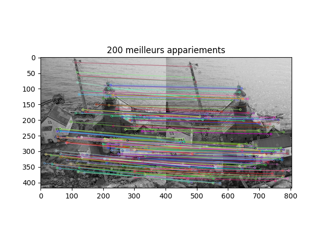
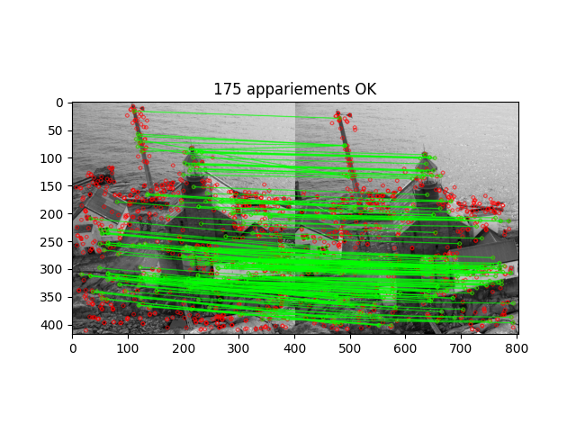
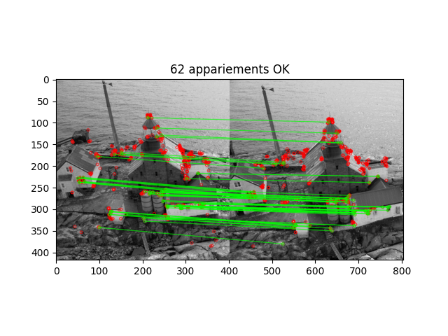

# TP 1

## Question 1

## Question 2

## Question 3

## Question 4

## Question 5

## Question 6

## Question 7
Les descripteurs associés aux points ORB et KAZE jouent un rôle essentiel dans l'appariement d'images, en permettant de retrouver des points correspondants même en présence de transformations telles que des changements d’échelle ou de rotation.

### 1. Points ORB (Oriented FAST and Rotated BRIEF)

#### a) Détecteur
Le détecteur ORB est basé sur FAST (Features from Accelerated Segment Test), qui détecte des coins en comparant l’intensité des pixels dans un voisinage circulaire. Cependant, FAST n'est pas invariant à la rotation ni à l'échelle.

#### b) Descripteur
Le descripteur ORB est basé sur BRIEF (Binary Robust Independent Elementary Features), qui encode les textures locales sous forme de chaînes binaires. BRIEF étant sensible à la rotation, ORB améliore cela en appliquant une rotation contrôlée du descripteur en fonction de l'orientation détectée.

### 2. Points KAZE
KAZE est un détecteur et descripteur basé sur l’analyse multi-échelle en exploitant des espaces d’échelle non linéaires.

#### a) Détecteur
Contrairement aux approches classiques basées sur des convolutions gaussiennes, KAZE utilise une diffusion anisotropique pour mieux préserver les structures.

#### b) Descripteur
Le descripteur KAZE encode l'information locale sous forme d’un vecteur de caractéristiques dérivé de l’intensité des gradients dans le voisinage du point détecté. Ce descripteur est conçu pour être robuste aux transformations photométriques et aux changements d’échelle.

### 3. En résumé :
- L'invariance à la rotation est assurée par la manière dont l’orientation est attribuée aux points clés et comment le descripteur est adapté.
- L'invariance à l’échelle repose sur la façon dont les points sont détectés à différentes échelles.

ORB est efficace et rapide, mais son invariance à l’échelle est approximative, tandis que KAZE offre une meilleure robustesse à l’échelle au prix d’un calcul plus coûteux.

## Question 8

## Question 9